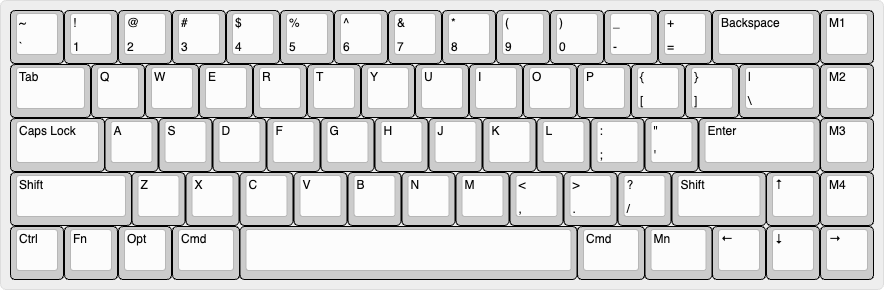

# Journal of making a keyboard from scratch

## The story

Among all of my microcontroller projects, 90% were made, played with, and forgotten. The only two that stayed with me are a keyboard and a mouse remapper. The office stuff stuck with me the most, and just made me the most satisfied.

In the DIY keyboard community, there are at least 3 groups of people:
- People trying to build the best feeling/looking keyboard
- People trying to build the most ergo keyboard
- People trying to build the most customized keyboard

As a microcontroller hobbyist, I am in the 3rd group. Actually, building keyboards, in the category of microcontroller projects, sounds like one of the easiest projects: it's just a set of buttons. What could go wrong?

So I designed and made my first keyboard 3 years ago from the ground up. I like most parts of the outcome, but it turned out to be a fairly complex project, balancing standard parts, customization, aesthetics, and cost.

During the project I learned a lot of lessons:
- 3D printed cases are much less precise than PCB cutouts.
- I never look at the OLED screen, and it is slow to drive.
- Those tiny trackballs feel horrible and are not precise enough to be used as a cursor device.
- Don't use any non-standard key scanning mechanism (I used an I2C extension rather than a diode matrix), which makes things less reliable and slower.
- I should have built the mouse remapper into the keyboard so I could use some key+cursor macros.

## The Specs

- 60%+ layout
- reverse slope for ergo gesture
- with regular keycap and stabilizer sizes (for lower cost)
- use PCB for the circuit, plate, and also the case.
- touchpad built in, with haptic feedback
- built-in USB host for cursor remapping
- touch button on the left panel serving as the ESC button
- no RGB, no screen
- diode grid, as normal keyboards do
- Customized CircuitPython firmware
- Macropad function built in

## The Process

### Layout design

Layout design needs to be done before anything else, because I need to visualize the proposed layout and prove it practical (mostly by thought experiment). Also, the following steps will rely on this design decision.

[keyboard-layout-editor.com](https://www.keyboard-layout-editor.com/) is a perfect tool for this. I can edit in a WYSIWYG UI, but my favorite method is to directly edit the raw text.

The design is a normal-looking but slightly customized layout. This is an improved version of my previous build.

The ideas are:
- regular layout for the first 4 rows
- four modifier keys on the left, resembling a Mac
- the Mn (Macro layer) and M1~M4 (macro keys) are at the positions of the trackball and OLED in the last version.
- ESC is not on the layout because it will be on the side panel as a touch button

The raw text of the layout is in the ./layouts/ folder.

## The Show and Tell

TODO